# ApexNav: VLM 환각 극복과 적응형 탐색을 통한 Zero-Shot Object Navigation
## 세미나 발표 자료

---

## 1. 논문 개요 (Paper Overview)

### 1.1 출판 정보

| 항목 | 내용 |
|------|------|
| **제목** | ApexNAV: An Adaptive Exploration Strategy for Zero-Shot Object Navigation With Target-Centric Semantic Fusion |
| **저자** | Mingjie Zhang, Yuheng Du, Chengkai Wu, Jinni Zhou, Zhenchao Qi, Jun Ma, Boyu Zhou |
| **소속** | Robotics-STAR Lab, HKUST(GZ) & SUSTech |
| **발표처** | IEEE Robotics and Automation Letters (RA-L), 2025, Vol. 10, pp. 11530-11537 |
| **DOI** | 10.1109/LRA.2025.3606388 |
| **arXiv** | [2504.14478](https://arxiv.org/abs/2504.14478) |
| **코드** | [GitHub - Robotics-STAR-Lab/ApexNav](https://github.com/Robotics-STAR-Lab/ApexNav) |

### 1.2 한 줄 요약

> ApexNav는 **VLM 환각(hallucination) 문제를 신뢰도 기반 다중 관찰 융합으로 극복**하고, **상황 적응형 탐색 전략**으로 효율성을 극대화한 Zero-Shot Object Navigation 시스템이다.

### 1.3 실제 환경 데모

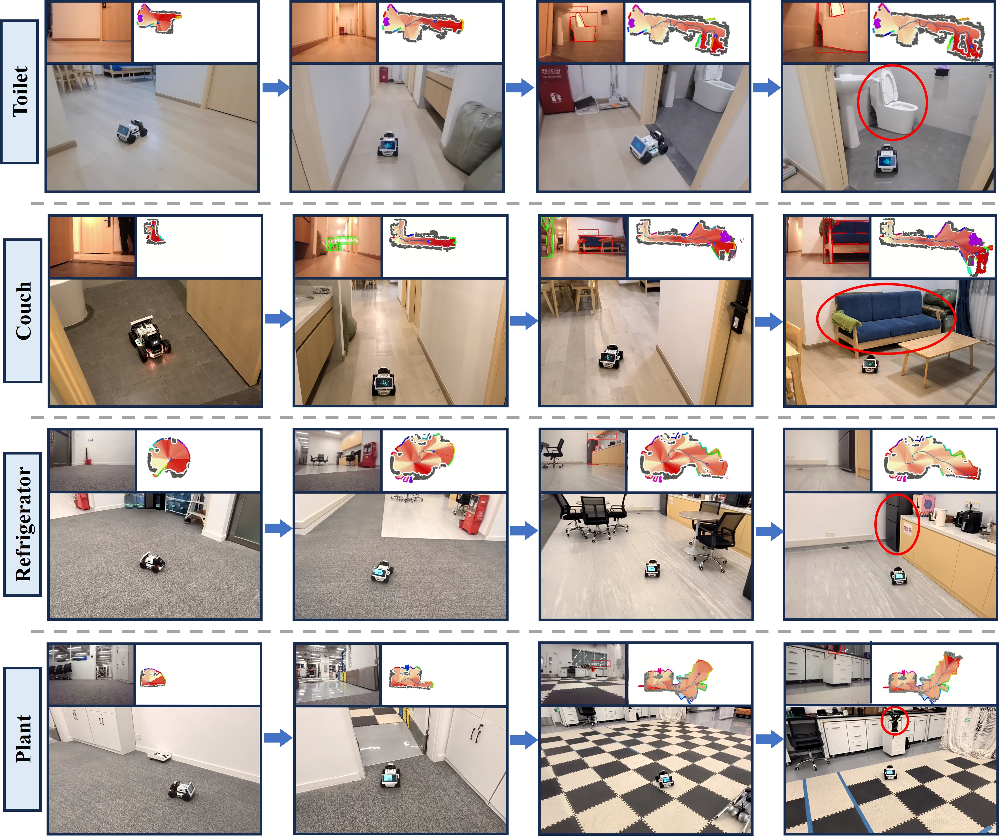
*Figure 1: ApexNav 실제 환경 테스트. Toilet, Couch, Refrigerator, Plant 등 다양한 목표 객체를 실내 환경에서 성공적으로 탐색. 각 행은 탐색 과정의 RGB 관찰, 시맨틱 맵 누적, 최종 도달 과정을 보여준다.*

---

## 2. Zero-Shot Object Navigation 문제 정의

### 2.1 태스크 정의

**Zero-Shot Object Navigation (ZS-ObjectNav)** 은 로봇이 **태스크 특화 학습 없이** 텍스트로 주어진 목표 객체를 미지의 환경에서 찾아 도달하는 과제이다.

> **"Zero-Shot"의 의미**: 사용하는 AI 모델(BLIP-2, GroundingDINO 등)은 대규모 데이터로 사전 학습(pre-training)되어 있다. 하지만 "이 환경에서 냉장고는 주방에 있다"와 같은 **태스크 특화 추가 학습 없이**, 범용 사전학습 모델만으로 동작한다는 의미이다.

```
입력: 텍스트 쿼리 "Find a [target object]" + 미지 환경
출력: 목표 객체 0.2m 이내 도달 시 STOP 액션 선언
      (STOP은 "도착했다"는 의도적 선언으로, 한 번 선언하면 취소 불가)
제약: 환경 사전 지식 없음, 태스크별 학습 없음
```

### 2.2 왜 "Zero-Shot"이 중요한가?

| 패러다임 | 학습 데이터 | 새 환경 일반화 | 새 객체 일반화 |
|----------|------------|--------------|--------------|
| Supervised (SemExp 등) | 대규모 in-domain | 제한적 | 불가 |
| Zero-Shot (VLFM, ApexNav 등) | 없음 | 우수 | 가능 |

**핵심 동기**: 실세계 로봇은 배포 환경을 미리 알 수 없으며, 사용자가 요청하는 객체 카테고리를 미리 정의할 수 없다.

### 2.3 ZS-ObjectNav의 3대 도전과제

```
┌────────────────────────────────────────────────────────────────┐
│                    ZS-ObjectNav Challenges                      │
├────────────────────┬───────────────────┬───────────────────────┤
│   Challenge 1      │   Challenge 2     │   Challenge 3         │
│   VLM 환각         │   탐색 효율성      │   장기 기억 부재      │
│   (Hallucination)  │   (Exploration)   │   (Long-term Memory)  │
├────────────────────┼───────────────────┼───────────────────────┤
│ VLM이 존재하지     │ 무작위 탐색은      │ 단일 프레임 판단은    │
│ 않는 객체를 검출   │ 비효율적이며       │ 누적 증거를 활용      │
│ (False Positive)   │ 의미론적 정보와    │ 하지 못함             │
│                    │ 기하학적 정보의    │                       │
│                    │ 균형이 필요        │                       │
└────────────────────┴───────────────────┴───────────────────────┘
```

### 2.4 핵심 용어 정리

본 발표에서 반복적으로 사용되는 핵심 용어를 먼저 정리한다.

| 용어 | 정의 |
|------|------|
| **VLM (Vision-Language Model)** | 이미지와 텍스트를 동시에 이해하는 AI 모델. 예: "이 사진에 의자가 있나요?"라는 질문에 답할 수 있다. |
| **환각 (Hallucination)** | VLM이 이미지에 **존재하지 않는 객체를 있다고 판단**하는 현상. 예: 빈 방에서 "의자 발견 (신뢰도 0.72)" |
| **프론티어 (Frontier)** | 로봇이 이미 탐색한 영역과 아직 탐색하지 않은 영역의 **경계선**. 프론티어로 이동하면 새로운 영역을 탐색할 수 있다. |
| **Value Map** | 2D 지도의 각 격자에 "이 방향에 목표 객체가 있을 가능성"을 0~1 점수로 기록한 **의미론적 가치 지도** |
| **Semantic Map (시맨틱 맵)** | 2D 지도의 각 격자에 객체 종류(의자, 침대 등)를 색상/라벨로 표시한 **의미론적 지도**. Value Map과 달리 객체 분류 결과를 담는다. |
| **ITM (Image-Text Matching)** | "이 이미지와 이 텍스트가 얼마나 잘 맞는가?"를 0~1 확률로 계산하는 기능. BLIP-2 모델이 이 기능을 제공한다. |
| **FOV (Field of View)** | 카메라가 한 번에 볼 수 있는 **시야각** (본 시스템에서 79°). 중심부가 가장자리보다 왜곡이 적어 신뢰도가 높다. |
| **SR (Success Rate)** | 전체 에피소드 중 목표 객체에 도달한 비율 (높을수록 좋음) |
| **SPL (Success weighted by Path Length)** | SR에 **경로 효율성**을 반영한 지표. SPL = (1/N) × Σ(S_i × L_i / max(P_i, L_i)). 성공하더라도 최단 경로 대비 먼 길을 돌아가면 점수가 낮아진다. |
| **Ablation Study** | 시스템의 구성 요소를 **하나씩 제거**하며 성능 변화를 측정하는 실험. 각 구성 요소의 기여도를 정량적으로 검증한다. |
| **Odometry (오도메트리)** | 로봇이 자신의 현재 위치와 자세를 추정하는 방법. 바퀴 회전, IMU 센서 등으로 계산한다. |
| **RGB-D 카메라** | 일반 컬러(RGB) 이미지와 함께 각 픽셀까지의 **거리(Depth)**를 측정하는 카메라. 이 depth 정보로 2D 이미지를 3D 공간으로 변환할 수 있다. |

---

## 3. VLM 환각 문제 심층 분석 (VLM Hallucination Deep Dive)

### 3.1 VLM 환각이란 무엇인가?

**정의**: Vision-Language Model(VLM)이 입력 이미지에 **실제로 존재하지 않는 객체를 존재한다고 판단**하거나(False Positive), **존재하는 객체를 잘못된 클래스로 분류**하는 현상.

> *"Large Vision-Language Models suffer from the hallucination problem, where they tend to generate objects that are inconsistent with the target images."*
> — Li et al., POPE: Evaluating Object Hallucination in Large Vision-Language Models, **EMNLP 2023**

#### 3.1.1 환각의 분류 체계 (Taxonomy)

```
VLM Hallucination
├── Object Existence Hallucination (객체 존재 환각)
│   ├── False Positive: 없는 객체를 있다고 검출
│   │   예: 빈 방에서 "chair detected (conf: 0.72)"
│   └── False Negative: 있는 객체를 놓침
│       예: 소파가 있지만 검출 실패
│
├── Object Identity Hallucination (객체 정체성 환각)
│   ├── Category Confusion: 유사 카테고리 혼동
│   │   예: bed → couch, chair → stool
│   └── Attribute Error: 속성 오판
│       예: "red chair" → 실제로는 brown
│
└── Spatial Hallucination (공간 환각)
    ├── Location Error: 잘못된 위치에 객체 배치
    └── Relation Error: 객체 간 관계 오판
```

#### 3.1.2 학술적 평가 프레임워크

VLM 환각이 단순한 추측이 아닌 **학술적으로 검증된 실재하는 문제**임을 보여주는 대표적 벤치마크들을 소개한다. ApexNav가 이 벤치마크들을 직접 사용하지는 않지만, 환각 문제의 심각성과 체계적 평가 방법론을 이해하는 데 필수적이다.

**POPE (Polling-based Object Probing Evaluation)** — EMNLP 2023:

POPE는 VLM의 객체 환각을 체계적으로 평가하는 벤치마크이다:

```
평가 방식:
1. 이미지에서 Ground Truth 객체 추출 (SEEM 등 사용)
2. 존재하지 않는 객체에 대한 Negative Sampling:
   - Random: 무작위 비존재 객체
   - Popular: 빈도가 높은 비존재 객체
   - Adversarial: GT와 자주 공존하는 비존재 객체
3. "Is there a [object] in the image?" → Yes/No 폴링

POPE 결과 (F1 Score, 높을수록 정확):
┌─────────────────┬──────────┬──────────┬──────────────┐
│ Model           │ Random   │ Popular  │ Adversarial  │
├─────────────────┼──────────┼──────────┼──────────────┤
│ InstructBLIP    │ 89.29    │ 83.45    │ 78.45        │
│ MiniGPT-4      │ 78.86    │ 72.21    │ 71.37        │
│ LLaVA           │ 68.65    │ 67.72    │ 66.98        │
└─────────────────┴──────────┴──────────┴──────────────┘
* Adversarial 설정에서 F1이 급락 → GT와 자주 공존하는 객체에 환각 취약
* LLaVA는 "Yes" 응답 비율이 99%+로, 거의 모든 질문에 객체 존재를 답변 (Precision ~50%)
```

> 출처: Li et al., "Evaluating Object Hallucination in Large Vision-Language Models," **EMNLP 2023** ([arXiv:2305.10355](https://arxiv.org/abs/2305.10355))

**THRONE (Object-based Hallucination Benchmark)** — CVPR 2024:

THRONE은 자유형 텍스트 생성에서의 객체 환각을 평가하는 프레임워크이다. POPE가 Yes/No 이진 질문에 국한되는 한계를 극복하여, 모델의 자연어 응답에서 환각된 객체를 자동 검출한다.

> 출처: Kaul et al., "THRONE: An Object-based Hallucination Benchmark for the Free-form Generations of Large Vision-Language Models," **CVPR 2024**

**Multi-Object Hallucination** — NeurIPS 2024:

다중 객체 설정에서의 환각을 분석한 연구로, VLM이 **여러 객체를 동시에 인식**할 때 환각률이 급격히 증가함을 보여준다. 단일 객체 인식 정확도가 높더라도, 복수 객체 동시 인식 시 상호 간섭이 발생한다.

> 출처: Chen et al., "Multi-Object Hallucination in Vision Language Models," **NeurIPS 2024**

### 3.2 Object Navigation에서의 VLM 환각: 왜 치명적인가?

#### 3.2.1 환각이 네비게이션에 미치는 영향

```
┌────────────────────────────────────────────────────────┐
│          VLM 환각 → 네비게이션 실패 경로                │
│                                                        │
│   [VLM 환각 발생]                                      │
│        │                                               │
│        ├─→ False Positive Detection                    │
│        │      │                                        │
│        │      ├─→ 잘못된 목표 지점으로 이동             │
│        │      ├─→ 비효율적 경로 (Path Length ↑)        │
│        │      └─→ 조기 종료 (SPL ↓↓)                  │
│        │                                               │
│        └─→ Category Confusion                          │
│               │                                        │
│               ├─→ 유사 객체에서 STOP 실행              │
│               ├─→ Success Rate 하락                    │
│               └─→ 반복적 탐색 루프                      │
│                                                        │
│   [결과] SR ↓, SPL ↓, Path Length ↑                   │
└────────────────────────────────────────────────────────┘
```

#### 3.2.2 실제 환각 사례: ApexNav 논문에서의 Case Study

**Case 1: 침대(bed)를 소파(couch)로 오분류**

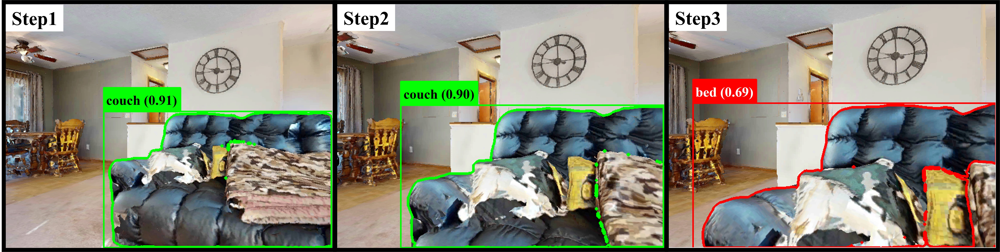
*Figure 2: VLM 환각의 전형적 사례. Step 1-2에서 GroundingDINO가 침대를 "couch (0.91)", "couch (0.90)"으로 높은 신뢰도로 오분류. Step 3에서 더 가까이 접근 후에야 "bed (0.69)"로 올바르게 분류되지만 신뢰도는 오히려 낮다.*

**이 사례가 보여주는 핵심 문제점:**

| Step | 검출 결과 | 신뢰도 | 실제 | 문제점 |
|------|----------|--------|------|--------|
| Step 1 | couch | **0.91** | bed | 높은 신뢰도의 False Positive |
| Step 2 | couch | **0.90** | bed | 연속적으로 잘못된 검출 유지 |
| Step 3 | bed | 0.69 | bed | 올바른 검출이지만 **신뢰도가 낮음** |

> **핵심 관찰**: VLM은 잘못된 판단에 대해서도 매우 높은 신뢰도를 부여한다. **신뢰도 점수가 정확도의 신뢰할 수 있는 지표가 아니다.**

**Case 2: FOV 밖으로 사라진 이전 검출 객체**

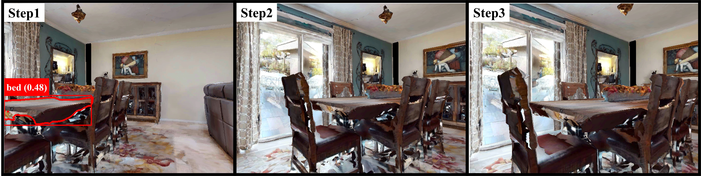
*Figure 3: (a) 침대를 소파로 오분류한 경우 시간에 따른 신뢰도 가중 융합으로 보정. (b) 이전 스텝에서 검출된 객체가 현재 FOV에서 보이지 않는 경우, 신뢰도 페널티가 자동 적용되어 오검출의 영향을 감소시킨다.*

### 3.3 BLIP-2 ITM의 환각 특성

**BLIP-2** (Bootstrapping Language-Image Pre-training) — **ICML 2023**:

BLIP-2는 Q-Former를 통해 Frozen Image Encoder와 Frozen LLM을 연결하는 효율적인 VLP 모델이다. ApexNav와 VLFM 모두 BLIP-2의 ITM(Image-Text Matching) 헤드를 사용한다.

> 출처: Li et al., "BLIP-2: Bootstrapping Language-Image Pre-training with Frozen Image Encoders and Large Language Models," **ICML 2023**

```
BLIP-2 ITM Architecture:
┌──────────────┐     ┌──────────────┐     ┌──────────────┐
│ Frozen Image │     │   Q-Former   │     │  Frozen LLM  │
│   Encoder    │────▶│  (Learnable) │────▶│   (OPT/      │
│ (ViT-g/14)   │     │  32 queries  │     │   FlanT5)    │
└──────────────┘     └──────┬───────┘     └──────────────┘
                            │
                     ┌──────▼───────┐
                     │   ITM Head   │
                     │  P(match|    │
                     │  image,text) │
                     │  ∈ [0, 1]    │
                     └──────────────┘
```

**BLIP-2 ITM의 환각 취약점:**

1. **Semantic Similarity Confusion**: 의미적으로 유사한 객체(bed/couch, chair/stool)에서 높은 매칭 점수 부여
2. **Partial Visibility Bias**: 객체가 부분적으로 보일 때 오판 확률 증가
3. **Context-driven Hallucination**: 주변 맥락(예: 거실에서 sofa 기대)이 판단에 영향
4. **단일 프레임 한계**: 한 번의 관찰로는 환각 여부 검증 불가

```
BLIP-2 ITM 환각 시나리오:

쿼리: "a sofa"
┌──────────────────────────────────────────────────┐
│  이미지: 침대가 있는 방                           │
│                                                   │
│  ITM Score: 0.91  ← 높은 False Positive!         │
│                                                   │
│  원인:                                            │
│  - 침대와 소파의 시각적 유사성 (cushion, fabric)  │
│  - 거실과 유사한 배경 맥락                        │
│  - 부분 가시성으로 인한 모호성                    │
└──────────────────────────────────────────────────┘
```

### 3.4 GroundingDINO의 환각 특성

**GroundingDINO** — **ECCV 2024**:

GroundingDINO는 DINO 검출기에 Grounded Pre-Training을 결합한 Open-Set Object Detector이다. COCO zero-shot에서 52.5 AP를 달성하나, **개방형 어휘 특성상 환각에 취약**하다.

> 출처: Liu et al., "Grounding DINO: Marrying DINO with Grounded Pre-Training for Open-Set Object Detection," **ECCV 2024** ([arXiv:2303.05499](https://arxiv.org/abs/2303.05499))

```
GroundingDINO Architecture:
┌───────────────┐   ┌───────────────┐
│ Image Backbone│   │ Text Backbone │
│  (Swin-T/B/L) │   │  (BERT-base)  │
└───────┬───────┘   └───────┬───────┘
        │                   │
        └─────────┬─────────┘
                  │
          ┌───────▼───────┐
          │   Feature      │
          │   Enhancer     │
          │  (Cross-Modal) │
          └───────┬───────┘
                  │
    ┌─────────────┼─────────────┐
    │             │             │
┌───▼────┐ ┌─────▼─────┐ ┌────▼────┐
│Language│ │Cross-Modal│ │  Box    │
│-Guided │ │  Decoder  │ │Prediction│
│ Query  │ │           │ │  Head   │
│Selection│ │           │ │         │
└────────┘ └───────────┘ └─────────┘
```

**GroundingDINO 환각 유형:**

| 환각 유형 | 설명 | 발생 빈도 |
|----------|------|----------|
| **Ghost Detection** | 이미지에 없는 객체를 text prompt로 인해 검출 | 높음 |
| **Category Leaking** | text에 나열된 다른 카테고리가 검출에 간섭 | 중간 |
| **Small Object Hallucination** | 원거리 소형 객체에서 오검출 빈도 증가 | 높음 |
| **Texture Confusion** | 유사 텍스처를 가진 다른 객체를 혼동 | 중간 |

---

앞서 VLM 환각의 심각성을 확인했다. 그렇다면 기존 방법들은 이 문제를 어떻게 다루고 있었을까? ApexNav의 직접적 비교 대상인 VLFM을 먼저 살펴본다.

## 4. 기존 방법론: VLFM 심층 분석

### 4.1 VLFM 논문 정보

| 항목 | 내용 |
|------|------|
| **제목** | VLFM: Vision-Language Frontier Maps for Zero-Shot Semantic Navigation |
| **저자** | Naoki Yokoyama, Sehoon Ha, Dhruv Batra, Jiuguang Wang, Bernadette Bucher |
| **소속** | Boston Dynamics AI Institute, Georgia Tech |
| **발표처** | **ICRA 2024** (Best Paper in Cognitive Robotics) |
| **arXiv** | [2312.03275](https://arxiv.org/abs/2312.03275) |
| **코드** | [GitHub - bdaiinstitute/vlfm](https://github.com/bdaiinstitute/vlfm) |

### 4.2 VLFM 핵심 아이디어

VLFM은 **인간의 탐색 전략에서 영감**을 받은 시스템이다:

> "사람이 냉장고를 찾을 때, 거실보다는 부엌 방향으로 먼저 향한다."

이 직관을 **Frontier-based Exploration + Vision-Language Value Map**으로 구현한다.

**프론티어(Frontier)의 역할**: 로봇이 지도를 만들어 가면서 탐색할 때, "이미 본 영역"과 "아직 안 본 영역"의 경계가 생긴다. 이 경계가 프론티어이다. 프론티어로 이동하면 새로운 영역을 볼 수 있으므로, **"다음에 어디로 갈까?"의 후보지점** 역할을 한다. VLFM은 이 프론티어들 중 목표 객체가 있을 가능성이 높은 쪽을 Value Map으로 선택한다.

```
프론티어 개념도:
┌─────────────────────────────┐
│ ████████░░░░░░░░░░░░░░░░░░ │  ████ = 탐색 완료 (Known)
│ ████████░░░░░░░░░░░░░░░░░░ │  ░░░░ = 미탐색 (Unknown)
│ ████████▓▓▓▓░░░░░░░░░░░░░░ │  ▓▓▓▓ = 프론티어 (Frontier)
│ ████████▓▓▓▓░░░░░░░░░░░░░░ │        → 여기로 이동하면
│ ████████░░░░░░░░░░░░░░░░░░ │          새 영역 탐색 가능
│ ██████░░░░░░░░░░░░░░░░░░░░ │
│  🤖                        │  🤖 = 로봇 현재 위치
└─────────────────────────────┘
```

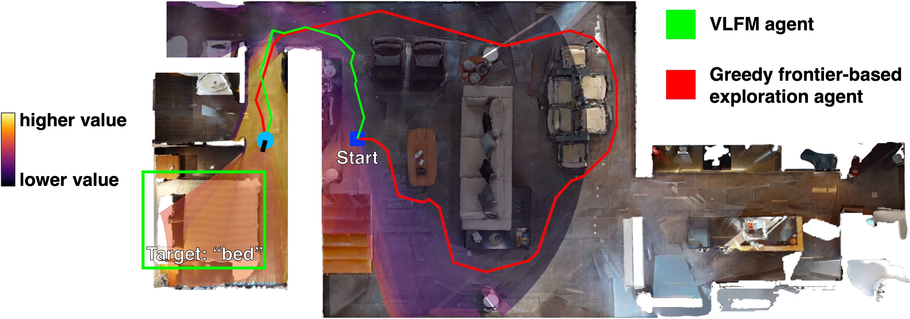
*Figure (VLFM-1): VLFM vs Greedy Frontier 탐색 비교. "bed" 탐색 태스크에서 VLFM(녹색)은 Value Map의 높은 값(노란색/주황색) 방향으로 직행하여 효율적으로 목표에 도달하는 반면, Greedy frontier agent(빨간색)는 가까운 프론티어만 선택하여 비효율적 경로를 생성한다. (출처: Yokoyama et al., VLFM, ICRA 2024)*

### 4.3 VLFM 시스템 아키텍처


*Figure (VLFM-2): VLFM 시스템 파이프라인. (좌) 초기화 → Semantic Frontier Exploration → Goal Navigation의 상태 머신. (우) RGB/Odometry/Depth 관찰로부터 Value Map과 Frontier Map을 생성하고, Best Frontier를 선택하여 Waypoint Navigation을 수행한다. (출처: Yokoyama et al., VLFM, ICRA 2024)*

### 4.4 VLFM의 Value Map 생성 방법

**VLFM의 핵심 = RGB 관찰에서 Language-Grounded Value Map을 생성**

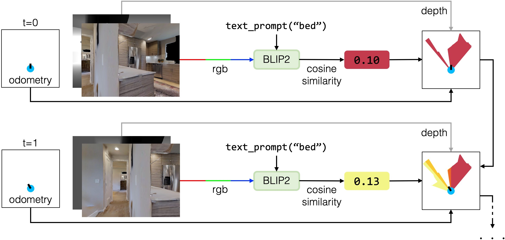
*Figure (VLFM-3): VLFM Value Map 구축 과정. 시간 t=0, t=1에서 RGB 이미지를 BLIP-2에 입력하여 "bed"에 대한 cosine similarity(0.10, 0.13)를 계산하고, depth 정보로 FOV 영역에 투영하여 Value Map을 누적 생성한다. (출처: Yokoyama et al., VLFM, ICRA 2024)*

> **용어 참고**: 위 그림의 "cosine similarity"는 BLIP-2 내부에서 이미지와 텍스트 임베딩 간의 유사도를 계산하는 방식이다. ITM(Image-Text Matching) 점수는 이 cosine similarity를 기반으로 "이미지와 텍스트가 매칭될 확률"을 0~1로 출력한 최종 결과이다. 즉, cosine similarity → ITM score로 변환되어 Value Map에 기록된다.

```
Step 1: RGB 이미지를 BLIP-2 ITM에 입력
        ITM_score = P(match | image_crop, "a [target]")

Step 2: Depth 정보로 FOV 영역을 2D 지도에 투영
        (RGB-D 카메라의 depth 값으로 "카메라가 보는 영역"을
         2D 격자 지도 위에 매핑)

Step 3: 투영된 영역의 각 격자에 ITM 점수 기록
        Value Map의 해당 그리드에 ITM 점수 기록

Step 4: 프론티어별 평균 Value 계산
        V_frontier = mean(Value Map cells near frontier)

Step 5: 가장 높은 Value를 가진 프론티어로 이동
        next_goal = argmax(V_frontier)
```

### 4.5 VLFM의 한계점 (ApexNav가 해결하는 문제)

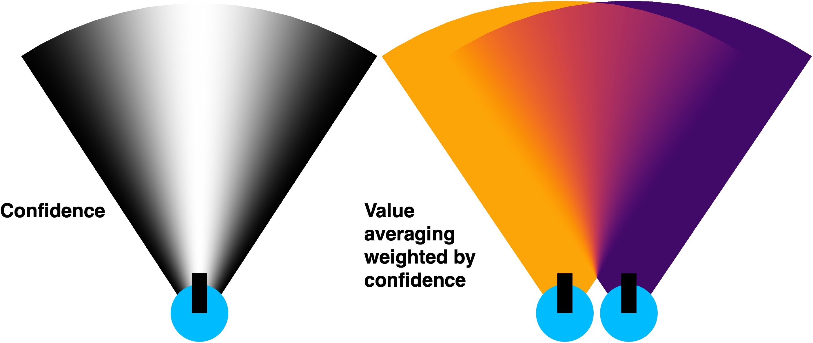
*Figure (VLFM-4): VLFM의 Confidence 마스크와 Value 평균화. (좌) FOV 중심부가 밝고(높은 신뢰도) 가장자리가 어두운(낮은 신뢰도) confidence 분포. (우) 두 시점의 관찰을 confidence 가중 평균하여 Value Map을 갱신. VLFM도 공간적 FOV confidence를 사용하나, 시간 축 누적에서 ApexNav의 제곱 융합보다 환각에 취약하다. (출처: Yokoyama et al., VLFM, ICRA 2024)*

#### 한계 1: 시간 축 융합의 환각 취약성

VLFM과 ApexNav 모두 **공간적(spatial) FOV confidence 마스크**를 사용한다 (FOV 중심부 = 높은 가중치, 가장자리 = 낮은 가중치). 핵심 차이는 **시간 축(temporal) 다중 관찰 누적 방식**이다.

```
VLFM의 시간 축 융합:
┌──────────────────────────────────────────────────────┐
│  V_new = (C_now × V_now + C_last × V_last)           │
│          / (C_now + C_last)                           │
│                                                       │
│  문제: confidence-weighted average는 선형적이어서     │
│  → 환각이 높은 C(FOV 중심)로 들어오면 그대로 반영    │
│  → 예: bed를 couch로 오인한 관찰이 FOV 중심에서      │
│    발생하면 C=0.9로 강하게 반영되어 보정이 어려움     │
│  → 시간이 지나도 환각 점수가 쉽게 희석되지 않음       │
└──────────────────────────────────────────────────────┘

ApexNav의 시간 축 융합:
┌──────────────────────────────────────────────────────┐
│  C_new = (C_now² + C_last²) / (C_now + C_last)       │
│  V_new = (C_now × V_now + C_last × V_last)           │
│          / (C_now + C_last)                           │
│                                                       │
│  개선: confidence 제곱(²) 누적으로 비선형 강화        │
│  → 반복적으로 높은 C에서 관찰될수록 누적 신뢰도 급상승│
│  → 한두 번의 환각은 다수의 올바른 관찰에 의해 희석    │
│  → 여러 각도에서 일관되게 검출되어야만 신뢰도 유지    │
│  → 결과: 환각에 대한 자연스러운 저항성(robustness)    │
└──────────────────────────────────────────────────────┘
```

#### 한계 2: 고정된 탐색 전략 — 상황 부적응

```
VLFM 전략:
  항상 argmax(V_frontier) → Semantic-only

문제 시나리오:
┌─────────────────────────────────────────────────┐
│ 모든 프론티어의 Semantic Value가 비슷한 경우:    │
│                                                  │
│ Frontier A: V = 0.32, Distance = 2m              │
│ Frontier B: V = 0.34, Distance = 15m             │
│ Frontier C: V = 0.31, Distance = 3m              │
│                                                  │
│ VLFM: Frontier B 선택 (V가 가장 높으므로)        │
│ → 15m나 이동해야 하지만 가치 차이는 0.02에 불과  │
│                                                  │
│ ApexNav: σ(V) < 0.030이므로 Distance-based 전환  │
│ → Frontier A 선택 (가장 가까움, 가치는 비슷)     │
│ → 탐색 효율성 대폭 향상                          │
└─────────────────────────────────────────────────┘
```

#### 한계 3: 단일 VLM 의존 — 검증 부재

```
VLFM:  BLIP-2 ITM만 사용 → 단일 모델의 환각을 검증할 수단 없음

ApexNav: Multi-modal VLM Ensemble
  ┌─────────────┐   ┌─────────────┐   ┌─────────────┐   ┌────────┐
  │GroundingDINO│ + │  BLIP-2 ITM │ + │ Mobile-SAM  │ + │ YOLOv7 │
  │(Open-vocab) │   │ (Matching)  │   │(Segmentation│   │(Detect)│
  └──────┬──────┘   └──────┬──────┘   └──────┬──────┘   └───┬────┘
         │                 │                  │              │
         └────────────┬────┴──────────────────┴──────────────┘
                      │
              ┌───────▼───────┐
              │  Cross-Modal  │
              │  Verification │
              │  & Fusion     │
              └───────────────┘
```

### 4.6 VLFM vs ApexNav 상세 비교

| 비교 항목 | VLFM (ICRA 2024) | ApexNav (RA-L 2025) |
|----------|-------------------|---------------------|
| **VLM 사용** | BLIP-2 ITM 단독 | GroundingDINO + BLIP-2 + SAM + YOLOv7 |
| **신뢰도 모델** | FOV 기반 선형 가중치 | FOV 기반 코사인 제곱 가중치 |
| **Value 융합** | 선형 confidence 가중 평균 | 신뢰도 제곱 가중 융합 |
| **환각 대응** | 제한적 (선형 누적) | 다중 관찰 누적 + 교차 검증 |
| **탐색 전략** | Semantic-only (고정) | 4가지 정책 동적 전환 |
| **TSP 최적화** | 없음 | LKH 기반 다중 프론티어 투어 |
| **장기 기억** | Value Map 시간 누적 (선형) | 신뢰도 제곱 시간 누적 (비선형) |
| **실세계 배포** | Boston Dynamics Spot | 커스텀 모바일 로봇 |

---

## 5. ApexNav 핵심 방법론

### 5.1 전체 시스템 파이프라인

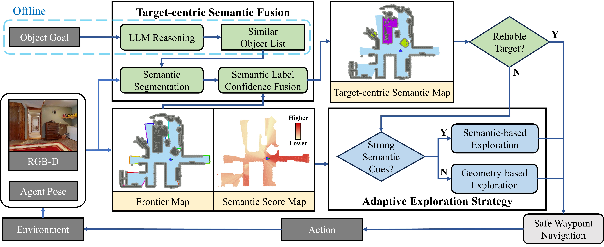
*Figure 4: ApexNav 시스템 파이프라인. (좌) LLM 기반 유사 객체 리스트 생성, (중) Frontier Map + Semantic Score Map으로 적응형 탐색 전략 결정, (우) Target-centric Semantic Fusion을 통한 신뢰성 있는 객체 식별 및 Safe Waypoint Navigation.*

**LLM의 역할**: 파이프라인 첫 단계에서 LLM(Large Language Model, 예: GPT 계열)에 목표 객체를 입력하면, **의미적으로 관련된 유사 객체 리스트**를 생성한다. 예를 들어 "refrigerator"를 찾으라고 하면 LLM이 ["kitchen", "microwave", "oven"] 등을 반환한다. 이 리스트는 탐색 시 "냉장고 근처에 있을 법한 객체"를 단서로 활용하여, 부엌 방향으로 탐색을 유도하는 데 사용된다.

**로봇의 이동 방식**: 로봇은 연속적인 조이스틱 제어가 아니라 **이산적(discrete) 행동**으로 움직인다. 매 스텝마다 (1) 0.25m 전진, (2) 좌/우 30° 회전, (3) STOP(도착 선언) 중 하나를 선택한다. 시뮬레이터(Habitat)의 표준 행동 공간이며, 실제 로봇에서도 동일한 이산 명령으로 제어한다.

### 5.2 Target-Centric Semantic Fusion (타겟 중심 의미론적 융합)

#### 5.2.1 핵심 아이디어

> **"한 번의 관찰로 판단하지 말고, 여러 각도에서 관찰한 증거를 누적하라."**

이것은 VLM 환각 문제의 근본적 해결책이다: **단일 프레임의 불확실한 판단 대신, 시간에 걸친 다중 관찰의 신뢰도 가중 융합**을 수행한다.


*Figure 5: Target-centric Semantic Fusion 파이프라인. Object Goal → LLM으로 유사 객체 추론 → 다중 프레임 Semantic Segmentation → 3D Point Cloud 기반 Object Point Cloud 구축 → Semantic Label Confidence Fusion을 통해 최종 Semantic Map 생성.*

#### 5.2.2 FOV 기반 신뢰도 가중치

**핵심 관찰**: 카메라 FOV(Field of View) 중심부의 관찰이 가장자리보다 더 정확하다.

```
카메라 FOV = 79°

신뢰도 분포:
        ◄─────── 79° ────────►
        │                     │
  C=0.0 ▓░░░░░░░█████░░░░░░░▓ C=0.0
        │       C=1.0        │
      가장자리              가장자리
        (노이즈↑)  중심  (노이즈↑)

수학적 모델:
  C(p) = cos²((θ_rel / (FOV/2)) × (π/2))

  θ_rel = 0° (중심)  → C = 1.0   (최대 신뢰도)
  θ_rel = 20° (중간) → C = 0.41  (중간 신뢰도)
  θ_rel = 39.5° (끝) → C = 0.0   (최소 신뢰도)
```

#### 5.2.3 신뢰도 기반 시간 누적 융합

```
시간 t=1:  관찰 1 → V₁=0.91(couch), C₁=0.8 (FOV 중심)
시간 t=2:  관찰 2 → V₂=0.90(couch), C₂=0.3 (FOV 가장자리)
시간 t=3:  관찰 3 → V₃=0.69(bed),   C₃=0.9 (FOV 중심, 근거리)

VLFM (선형 confidence 가중 평균, C 선형 누적):
  Step 1→2: C_acc = 0.8+0.3 = 1.1
             V = (0.8×0.91+0.3×0.90)/1.1 = 0.907
  Step 2→3: V = (0.9×0.69+1.1×0.907)/(0.9+1.1) = 0.810
  → V=0.810, 여전히 환각 관찰(couch)의 영향이 강하게 잔존 ✗

ApexNav (신뢰도 제곱 융합, C² 비선형 누적):
  Step 1→2: C = (0.8²+0.3²)/(0.8+0.3) = 0.664
             V = (0.8×0.91+0.3×0.90)/(0.8+0.3) = 0.907
  Step 2→3: C = (0.9²+0.664²)/(0.9+0.664) = 0.800
             V = (0.9×0.69+0.664×0.907)/(0.9+0.664) = 0.782
  → V=0.782, 고신뢰 근거리 관찰(bed)의 가중치가 더 커짐 ✓

  차이: VLFM 0.810 vs ApexNav 0.782
  → C² 누적이 환각 관찰의 잔존 영향을 추가 억제
```

### 5.3 Adaptive Exploration Strategy (적응형 탐색 전략)

#### 5.3.1 4가지 탐색 정책


*Figure 6: 적응형 탐색 예시. "Toilet" 탐색 과정에서 에이전트가 Geometry-based → Semantic-based → Geometry-based → Semantic-based 탐색 모드를 환경 상황에 따라 동적 전환. 높은 Semantic Score 영역(빨간색)이 발견되면 Semantic 모드로, 균등 분포면 Geometry 모드로 자동 전환한다.*

```
┌──────────────────────────────────────────────────────────────┐
│              Adaptive Strategy Selection                      │
│                                                               │
│   프론티어 Semantic Values: {V₁, V₂, ..., Vₙ}               │
│                                                               │
│   통계 계산:                                                  │
│   σ = std_dev(V₁, ..., Vₙ)     ← 분산 측정                  │
│   r = max(V) / mean(V)         ← 우점성 측정                 │
│                                                               │
│   ┌──────────────┐                                            │
│   │ σ < 0.030 AND│───Yes──→ [Policy 1: Distance-based]       │
│   │ r < 1.20     │          "모든 값이 비슷 → 가까운 곳부터" │
│   └──────┬───────┘                                            │
│          No                                                   │
│   ┌──────▼───────┐                                            │
│   │ σ > 0.030 OR │───Yes──→ [Policy 2: Semantic-based]       │
│   │ r > 1.20     │          "뚜렷한 차이 → 높은 값 우선"     │
│   └──────┬───────┘                                            │
│          No                                                   │
│   ┌──────▼───────┐                                            │
│   │ n > MTSP_TH  │───Yes──→ [Policy 4: TSP-Optimized]       │
│   └──────┬───────┘          "다수 프론티어 → 최적 투어"       │
│          No                                                   │
│          └─────────────────→ [Policy 3: Hybrid]               │
│                              "거리+의미론 가중 조합"          │
└──────────────────────────────────────────────────────────────┘
```

#### 5.3.2 TSP 기반 다중 프론티어 최적 투어

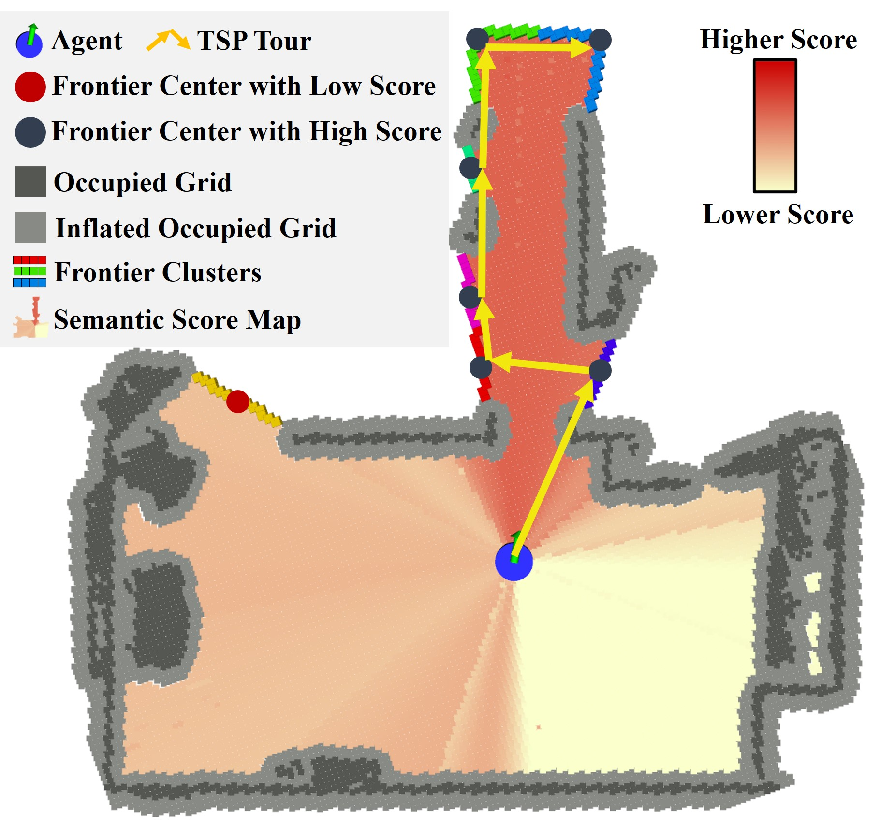
*Figure 7: Semantic Score Map 위에서의 TSP 투어 계획. 빨간 원(Low Score 프론티어)은 제외되고, 파란 원(High Score 프론티어)만 선별되어 LKH 알고리즘으로 최적 방문 순서(노란 화살표)가 계산된다. 이를 통해 의미론적으로 유망한 프론티어들을 최단 경로로 순회한다.*

적응형 탐색이 "어디로 갈 것인가"를 결정한다면, 다음 단계는 "목표 객체를 정말 찾았는가"를 검증하는 것이다. ApexNav는 단일 모델에 의존하지 않고, 4개의 서로 다른 VLM을 교차 검증하여 환각을 억제한다.

### 5.4 다중 모달 VLM 앙상블

ApexNav는 4개의 VLM을 앙상블하여 환각을 억제한다:

```
Detection & Verification Pipeline:

[RGB Image]
    │
    ├──→ [GroundingDINO] ──→ Boxes + Phrases + Confidence
    │     Open-vocabulary       (ECCV 2024)
    │     detection
    │
    ├──→ [YOLOv7] ──→ Boxes + Class + Confidence
    │     COCO pre-trained     2차 검증용
    │     detection
    │
    ├──→ [Mobile-SAM] ──→ Instance Masks
    │     Segment Anything     정밀 분할
    │     Mobile version
    │
    └──→ [BLIP-2 ITM] ──→ Matching Score [0, 1]
          Image-Text           (ICML 2023)
          Matching

          ┌──────────────────────────────┐
          │     Cross-Validation         │
          │                              │
          │ IF GroundingDINO ✓           │
          │ AND YOLOv7 ✓                 │
          │ AND BLIP-2 ITM > threshold   │
          │ THEN: High confidence        │
          │                              │
          │ IF only 1 model detects      │
          │ THEN: Suspicious → 추가 관찰 │
          │                              │
          │ IF 0 models detect           │
          │ THEN: Reject                 │
          └──────────────────────────────┘
```

**각 모델의 역할 정리:**
- **GroundingDINO**: "이 텍스트에 해당하는 객체가 이미지 어디에 있는가?" → 바운딩 박스 출력
- **YOLOv7**: COCO 80개 카테고리에 대한 빠른 2차 검증 (GroundingDINO와 독립적으로 검출)
- **Mobile-SAM**: GroundingDINO가 찾은 바운딩 박스 영역을 **픽셀 단위로 정밀 분할** (객체 윤곽 추출)
- **BLIP-2 ITM**: 분할된 객체 이미지와 텍스트의 매칭 확률을 최종 계산

> 하나의 모델만 검출했다면 환각 가능성이 높으므로 "의심" 상태로 분류하고, 더 가까이 접근하여 재확인한다.

위의 모든 구성 요소(Semantic Fusion, Adaptive Exploration, VLM Ensemble)를 하나의 시스템으로 통합하여 실행 흐름을 관리하는 것이 아래의 유한 상태 기계(FSM)이다. FSM은 로봇이 현재 어떤 상태인지(탐색 중, 목표 접근 중, 의심 객체 재확인 중 등)를 추적하고, 상황에 따라 다음 행동을 결정한다.

### 5.5 Finite State Machine (유한 상태 기계)

```
┌──────┐    trigger     ┌─────────────┐    plan    ┌──────────────┐
│ INIT │───────────────▶│ WAIT_TRIGGER │──────────▶│ PLAN_ACTION  │
└──────┘                └─────────────┘            └──────┬───────┘
                                                          │
                              ┌────────────────────────────┘
                              │
                              ▼
                        ┌───────────┐    publish   ┌────────────┐
                        │WAIT_ACTION│─────────────▶│ PUB_ACTION │
                        │  FINISH   │              └─────┬──────┘
                        └───────────┘                    │
                              ▲                          │
                              └──────────────────────────┘
                                   (loop until FINISH)

탐색 모드 (EXPL_RESULT):
┌─────────────────────────────────────────────────────────────┐
│ EXPLORATION (0)          ← 일반 프론티어 탐색               │
│ SEARCH_BEST_OBJECT (1)   ← 고신뢰도 객체 접근              │
│ SEARCH_OVER_DEPTH (2)    ← 원거리 객체 확인                │
│ SEARCH_SUSPICIOUS (3)    ← 의심 객체 재확인                 │
│ NO_PASSABLE_FRONTIER (4) ← 통과 가능 프론티어 없음          │
│ NO_COVERABLE_FRONTIER (5)← 탐사 가능 프론티어 없음          │
│ SEARCH_EXTREME (6)       ← 극단적 탐색 (마지막 수단)       │
└─────────────────────────────────────────────────────────────┘
```

---

## 6. 성능 비교 및 분석

### 6.1 벤치마크 데이터셋

| 데이터셋 | 장면 수 | 특징 | 난이도 |
|----------|---------|------|--------|
| **HM3Dv1** | 800+ | 다양한 실내, 단층 | 중간 |
| **HM3Dv2** | 800+ | 개선된 메쉬, 다층 | 낮음-중간 |
| **MP3D** | 90+ | 복잡한 다층 구조 | 높음 |

### 6.2 주요 성능 비교 (Table I from Paper)

> **성능 지표 참고**: SR(Success Rate)은 목표 객체에 도달한 비율이고, SPL은 SR에 경로 효율성을 반영한 지표이다(Section 2.4 용어 정리 참조). 두 지표 모두 높을수록 좋다. SR이 높아도 SPL이 낮으면 "도달은 하지만 먼 길을 돌아갔다"는 의미이다.

#### HM3Dv1 결과

| Method | Venue | SR (%) | SPL (%) |
|--------|-------|--------|---------|
| SemExp | NeurIPS 2020 | 21.0 | 9.4 |
| ZSON | NeurIPS 2022 | 25.5 | 12.6 |
| CoW | CVPR 2023 | 23.0 | 8.8 |
| ESC | ICML 2023 | 38.0 | 22.4 |
| **VLFM** | **ICRA 2024** | **52.5** | **30.4** |
| SG-Nav | NeurIPS 2024 | 48.8 | 27.0 |
| TriHelper | IROS 2024 | 56.5 | 25.3 |
| **ApexNav** | **RA-L 2025** | **59.6** | **33.0** |

#### HM3Dv2 결과

| Method | Venue | SR (%) | SPL (%) |
|--------|-------|--------|---------|
| SemExp | NeurIPS 2020 | 21.1 | 9.6 |
| CoW | CVPR 2023 | 28.6 | 12.4 |
| ESC | ICML 2023 | 46.0 | 30.0 |
| **VLFM** | **ICRA 2024** | **63.6** | **32.5** |
| SG-Nav | NeurIPS 2024 | 56.2 | 24.1 |
| TriHelper | IROS 2024 | 69.2 | 30.3 |
| **ApexNav** | **RA-L 2025** | **76.2** | **38.0** |

> **ApexNav vs VLFM (HM3Dv2): SR +12.6%p, SPL +5.5%p**

#### MP3D 결과

| Method | Venue | SR (%) | SPL (%) |
|--------|-------|--------|---------|
| SemExp | NeurIPS 2020 | 9.3 | 4.5 |
| CoW | CVPR 2023 | 6.7 | 3.6 |
| ESC | ICML 2023 | 24.5 | 14.6 |
| **VLFM** | **ICRA 2024** | **36.4** | **17.5** |
| SG-Nav | NeurIPS 2024 | 40.2 | 16.0 |
| **ApexNav** | **RA-L 2025** | **39.2** | **17.8** |

### 6.3 Ablation Study: Semantic Fusion의 효과

**Semantic Fusion의 기여도 (Table IV from Paper):**

| 설정 | HM3Dv1 SR | HM3Dv1 SPL | HM3Dv2 SR | HM3Dv2 SPL | MP3D SR | MP3D SPL |
|------|-----------|------------|-----------|------------|---------|----------|
| **Without Fusion** | 44.5% | 25.5% | 55.0% | 29.7% | 27.8% | 14.0% |
| **With Fusion (Full)** | **59.6%** | **33.0%** | **76.2%** | **38.0%** | **39.2%** | **17.8%** |
| **향상폭** | **+15.1%** | **+7.5%** | **+21.2%** | **+8.3%** | **+11.4%** | **+3.8%** |

> **핵심 발견**: Target-Centric Semantic Fusion만으로 SR이 15-21%p 향상. 이는 VLM 환각 감소가 네비게이션 성능에 **직접적이고 극대한 영향**을 미친다는 것을 입증한다.

### 6.4 Ablation Study: 탐색 전략의 효과

**Exploration Strategy 조합 (Table II from Paper, HM3Dv2):**

| Semantic 전략 | Geometry 전략 | SR (%) | SPL (%) |
|--------------|--------------|--------|---------|
| Closest | Closest | 64.50 | 33.96 |
| Max-value | Closest | 67.80 | 34.31 |
| **TSP** | Closest | 73.70 | 36.54 |
| TSP | Greedy | **76.20** | **38.03** |

> **TSP 최적화**: Closest → TSP로 변경만으로 SR +5.9%p. 다중 프론티어 순회 최적화의 효과가 명확하다.

### 6.5 실패 원인 분석

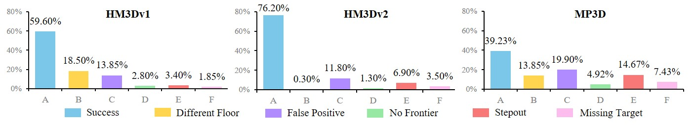
*Figure 8: ApexNav 실패 원인 분석 (HM3Dv1, HM3Dv2, MP3D). A=Success, B=Different Floor(다른 층), C=False Positive(오검출), D=No Frontier(프론티어 소진), E=Stepout(시간 초과), F=Missing Target(미발견). HM3Dv2에서 76.2% 성공률. MP3D에서 False Positive(19.9%)가 주요 실패 원인으로, 복잡한 다층 환경에서 VLM 환각 문제가 여전히 도전과제임을 보여준다.*

---

## 7. 관련 연구 계보 (Research Lineage)

### 7.1 Object Navigation 방법론 진화

```
2020 ──────────────────────────────────────────────────── 2025
  │                                                        │
  │ [SemExp]          [CoW]      [VLFM]      [ApexNav]    │
  │ NeurIPS'20        CVPR'23    ICRA'24     RA-L'25      │
  │                                                        │
  │ Supervised        Zero-Shot  Zero-Shot   Zero-Shot     │
  │ Semantic Map      CLIP-based VLM Value   Adaptive      │
  │ + Goal Policy     Frontier   Map         + Fusion      │
  │                                                        │
  │ 한계:             한계:      한계:       해결:          │
  │ 학습 필요         환각 무시  환각 부분   환각 극복      │
  │ 새 객체 불가      고정 전략  고정 전략   적응형 전략    │
  │                                                        │
  │         ◀── Zero-Shot 패러다임 전환 ──▶               │
```

### 7.2 주요 선행 연구 요약

| 논문 | 발표처 | 핵심 기여 | 한계 |
|------|--------|----------|------|
| **SemExp** (Chaplot et al.) | NeurIPS 2020 | Goal-Oriented Semantic Exploration, 모듈형 설계 | 학습 기반, zero-shot 불가 |
| **CoW** (Gadre et al.) | CVPR 2023 | CLIP 기반 zero-shot ObjectNav 벤치마크 | 환각 미처리, 단순 탐색 |
| **VLFM** (Yokoyama et al.) | ICRA 2024 | VLM 기반 Frontier Value Map, 실세계 배포 | 환각 취약, 고정 전략 |
| **GroundingDINO** (Liu et al.) | ECCV 2024 | Open-set detection SOTA | 환각 발생 |
| **BLIP-2** (Li et al.) | ICML 2023 | 효율적 VLP, Q-Former | 신뢰도 보정 부재 |
| **POPE** (Li et al.) | EMNLP 2023 | VLM 환각 평가 벤치마크 | 평가만, 해결 미제시 |
| **ApexNav** (Zhang et al.) | RA-L 2025 | 환각 극복 + 적응형 탐색 | MP3D 복잡 환경 한계 |

---

## 8. 시스템 구현 (Implementation)

### 8.1 소프트웨어 스택

```
┌──────────────────────────────────────────────────────────────┐
│                    Software Architecture                      │
├──────────────────────────────────────────────────────────────┤
│                                                               │
│  Python Layer ─────────────────────────────────────────────  │
│  │ Habitat Simulator Interface                               │
│  │ VLM Server (Flask + PyTorch)                              │
│  │   ├─ GroundingDINO (Port 12181)                           │
│  │   ├─ BLIP-2 ITM   (Port 12182)                           │
│  │   ├─ Mobile-SAM   (Port 12183)                           │
│  │   └─ YOLOv7       (Port 12184)                           │
│                                                               │
│  C++ Layer (ROS2 Jazzy) ──────────────────────────────────   │
│  │ ExplorationFSM    - 상태 기계 관리                        │
│  │ PlanningManager   - A*, KinoA*, LKH TSP                  │
│  │ ValueMap2D        - 신뢰도 가중 의미론적 맵               │
│  │ FrontierMap2D     - 프론티어 검출/관리                    │
│  │ ObjectMap2D       - 객체 추적                             │
│  │ SDFMap2D          - 점유 격자                             │
│                                                               │
│  Hardware ─────────────────────────────────────────────────  │
│  │ RGB-D Camera (79° FOV, 0.5-10m depth)                     │
│  │ GPU (VLM inference)                                       │
│  │ Onboard Computer (ROS2 navigation)                        │
└──────────────────────────────────────────────────────────────┘
```

### 8.2 핵심 파라미터

| 파라미터 | 값 | 용도 |
|---------|-----|------|
| `EXEC_TIMER` | 10ms (100 Hz) | FSM 실행 주기 |
| `FRONTIER_TIMER` | 250ms (4 Hz) | 프론티어 업데이트 |
| `ACTION_DISTANCE` | 0.25m | 전진 이동 거리 |
| `ACTION_ANGLE` | 30° (π/6) | 회전 각도 |
| `REACH_DISTANCE` | 0.20m | 객체 도달 판정 |
| `FOV` | 79° | 카메라 시야각 |
| `σ_threshold` | 0.030 | 전략 전환 임계값 |
| `r_threshold` | 1.20 | 우점성 임계값 |

---

## 9. 토론 및 향후 과제 (Discussion & Future Work)

### 9.1 ApexNav의 핵심 기여 요약

```
┌────────────────────────────────────────────────────────────┐
│                   ApexNav Contributions                     │
├────────────────────────────────────────────────────────────┤
│                                                             │
│  1. Target-Centric Semantic Fusion                          │
│     ├── FOV 기반 신뢰도 가중치 모델                        │
│     ├── 시간 누적 신뢰도 제곱 융합                         │
│     └── Ablation: Fusion 제거 시 SR 15-21%p 하락           │
│                                                             │
│  2. Adaptive Exploration Strategy                           │
│     ├── 통계 기반 4가지 정책 자동 전환                     │
│     ├── TSP 최적화 다중 프론티어 투어                      │
│     └── TSP 전환만으로 SR +5.9%p, SPL +2.2%p              │
│                                                             │
│  3. Multi-modal VLM Ensemble                                │
│     ├── 4개 VLM 교차 검증                                  │
│     └── 단일 모델 대비 환각 감소                           │
│                                                             │
│  4. SOTA Performance                                        │
│     ├── HM3Dv1: SR 59.6%, SPL 33.0%                       │
│     ├── HM3Dv2: SR 76.2%, SPL 38.0%                       │
│     └── MP3D: SR 39.2%, SPL 17.8%                          │
│                                                             │
└────────────────────────────────────────────────────────────┘
```

### 9.2 남은 도전과제

| 도전과제 | 설명 | 관련 데이터 |
|---------|------|------------|
| **다층 건물** | MP3D의 Different Floor 실패 (13.9%) | Figure 8 참조 |
| **False Positive** | MP3D에서 여전히 19.9% 오검출 실패 | 복잡한 환경의 한계 |
| **동적 환경** | 움직이는 물체/사람 미대응 | 현재 정적 환경 가정 |
| **계산 비용** | 4개 VLM 동시 추론의 GPU 부하 | 실시간성 vs 정확도 |

### 9.3 향후 연구 방향

1. **Foundation Model 통합**: GPT-4V, Gemini 등 차세대 VLM으로의 확장
2. **동적 환경 대응**: 움직이는 객체, 사람과의 상호작용
3. **멀티 에이전트**: 다수 로봇의 협력 탐색
4. **장기 자율 운영**: 배터리, 맵 갱신, 환경 변화 대응

---

## 10. 발표 토론 포인트 (Discussion Points)

### Q&A 예상 질문 및 답변

**Q1: "FOV 기반 신뢰도가 왜 코사인 제곱인가? 선형이나 가우시안은?"**

> 코사인 제곱은 (1) 중심부에서 평탄한 고신뢰도 영역을 제공하고, (2) 가장자리에서 급격히 감소하며, (3) 미분 가능하여 그래디언트 기반 최적화에 유리하다. 가우시안 대비 계산이 가볍고, 선형 대비 중심부 안정성이 높다.

**Q2: "VLFM 대비 환각 감소를 정량적으로 어떻게 측정했는가?"**

> Ablation Study (Table IV)에서 Semantic Fusion을 제거하면 SR이 15-21%p 하락한다. False Positive로 인한 실패율이 Figure 8에서 13.9% (HM3Dv1) → MP3D에서 19.9%로, 환경 복잡도에 따른 환각 영향을 정량 제시한다.

**Q3: "4개 VLM 앙상블의 계산 오버헤드는?"**

> RPC 기반 분리 서버 구조로 병렬 추론한다. 100Hz FSM 주기를 유지하면서 VLM 추론은 비동기로 처리된다. 실시간 성능 저하 없이 앙상블 효과를 얻는다.

**Q4: "TSP 솔버(LKH)가 실시간에 적합한가?"**

> TSP는 NP-hard 문제로 일반적으로 최적해를 구하기 어렵지만, LKH는 **휴리스틱 근사 해법**으로 프론티어 수 10-20개 규모에서 수 밀리초 내 실용적 근사해를 산출한다. 최적해 대비 1-2% 이내의 품질을 보인다.

---

## 11. 발전 방향: Vision-Planning Transformer 통합 (E2E로의 전환)

### 11.1 RRT*former: 환경 인지 Transformer 기반 경로 계획

**RRT\*former** (arXiv 2511.15414, 2025)는 기존 RRT\* 알고리즘의 무작위 샘플링을 Transformer로 대체하여, 환경 특징과 탐색 이력을 기반으로 **학습된 샘플링**을 수행하는 경로 계획 알고리즘이다.

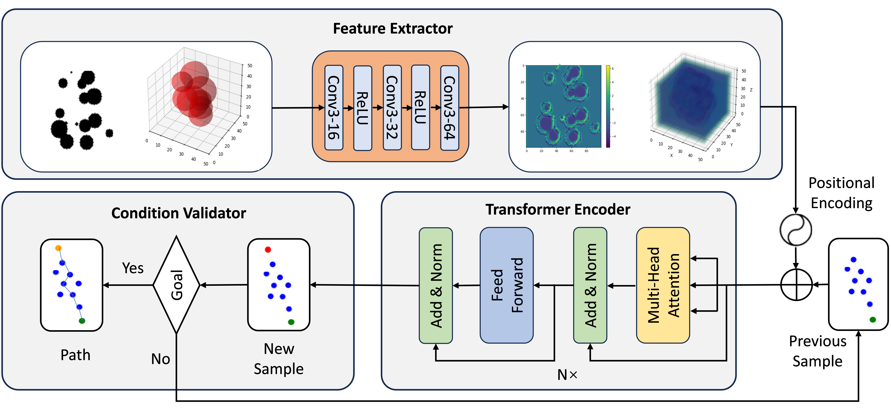
*Figure 9: RRT\*former Sampler Model 아키텍처. Feature Extractor(CNN)가 환경 특징을 추출하고, Transformer Encoder가 이전 샘플링 이력과 환경 특징을 결합하여 다음 샘플을 생성한다. Condition Validator가 목표 도달 여부를 판단한다. (출처: Feng et al., RRT\*former, arXiv 2025)*

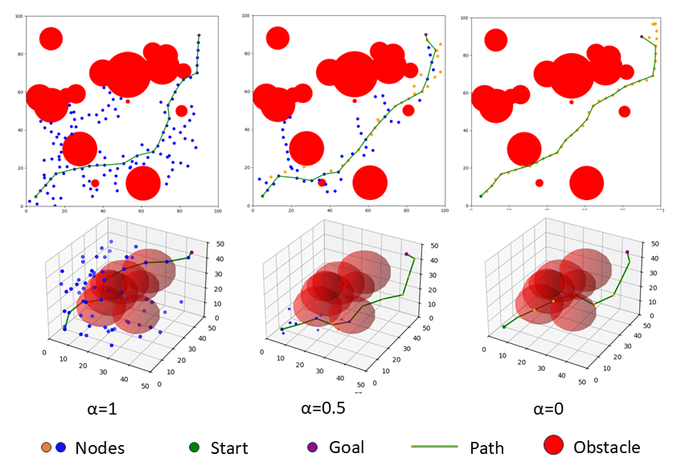
*Figure 10: RRT\*former의 탐색 트리 비교. 기존 RRT\*의 무작위 확장 대비, RRT\*former는 환경을 인지하여 유망한 영역에 집중적으로 샘플링한다. (출처: Feng et al., RRT\*former, arXiv 2025)*

### 11.2 ApexNav → Vision-Planning Transformer 통합 구상

현재 ApexNav의 모듈형 파이프라인을 인식+계획 통합 Transformer로 발전시키는 방향을 제안한다.

```
현재 ApexNav (완전 모듈형):
  RGB-D → [VLM 4개] → Semantic Fusion → Value Map → Adaptive Strategy → A*/TSP → Action
          ├── 4개 독립 모델 ──┤  ├─ C² 수식 ─┤  ├─ 수작업 임계값 ──┤

Vision-Planning Transformer (통합형):
  RGB-D + "Find a chair" → [Vision Transformer] → [Planning Transformer] → Action
                            환경 인식+융합 통합      탐색 전략+경로 통합
```

#### 아키텍처 상세

```
┌──────────────────────────────────────────────────────────────┐
│                     Vision Transformer                         │
│                                                                │
│  입력: RGB-D 시퀀스 (t-k ~ t) + 텍스트 "Find a chair"         │
│                                                                │
│  ┌───────────┐   ┌───────────┐   ┌──────────────┐            │
│  │ Image      │   │ Depth     │   │ Text Encoder │            │
│  │ Encoder    │   │ Encoder   │   │ (Frozen LLM) │            │
│  │ (ViT)      │   │ (ViT)     │   │              │            │
│  └─────┬──────┘   └─────┬─────┘   └──────┬───────┘            │
│        └────────────┬────┴────────────────┘                    │
│                     ▼                                          │
│           Cross-Attention Fusion                               │
│           (4개 VLM + C² 융합을 한번에 대체)                     │
│                     │                                          │
│  출력: Spatial Feature Map (latent Value Map 역할)              │
└─────────────┬────────────────────────────────────────────────┘
              │
              ▼
┌──────────────────────────────────────────────────────────────┐
│                    Planning Transformer                        │
│                                                                │
│  입력: Spatial Feature + 탐색 이력 (이전 위치/관찰 시퀀스)     │
│                                                                │
│  ┌───────────────────────────────────────┐                     │
│  │ Self-Attention over:                  │                     │
│  │  · 현재 환경 특징 (Vision 출력)       │                     │
│  │  · 과거 관찰 시퀀스 (메모리)          │  ← RRT*former      │
│  │  · 로봇 위치/자세 이력               │    아이디어 적용     │
│  └──────────────┬────────────────────────┘                     │
│                 ▼                                              │
│  출력: Next Waypoint (x, y) 또는 Action (전진/회전/STOP)       │
└──────────────────────────────────────────────────────────────┘
```

#### 대체되는 모듈

| 대체 대상 | 현재 ApexNav (모듈형) | Vision-Planning Transformer (통합형) |
|----------|----------------------|-------------------------------------|
| VLM 4개 앙상블 | GroundingDINO + BLIP-2 + SAM + YOLOv7 | Vision Transformer 하나로 통합 |
| Semantic Fusion | C² 수작업 수식 | Cross-Attention이 자동 학습 |
| Value Map | 명시적 2D 격자 | Latent space (암묵적) |
| 탐색 전략 | σ/r 임계값 기반 4정책 | Planning Transformer 직접 출력 |
| 경로 계획 | A* / LKH TSP | Waypoint 직접 예측 |

#### RRT*former 아이디어의 적용 지점

RRT\*former의 **"환경 특징(CNN) + 이전 샘플 이력(Transformer) → 다음 유망 지점 예측"** 구조를 Planning Transformer에 적용한다:

| RRT\*former 요소 | Navigation 대응 |
|-----------------|-----------------|
| 환경 맵 (CNN 특징) | Value Map / Spatial Feature |
| 이전 샘플 노드 이력 | 이전 방문 프론티어/위치 시퀀스 |
| 다음 샘플 생성 | 다음 탐색 목표 프론티어 선택 |
| Condition Validator | STOP 조건 판단 (목표 도달 여부) |

### 11.3 주요 도전과제

| 도전과제 | 설명 | 완화 방안 |
|---------|------|----------|
| **학습 데이터** | 대규모 네비게이션 trajectory 필요 | HM3D/MP3D 시뮬레이터에서 수집 |
| **Zero-Shot 유지** | 학습 기반 전환 시 범용성 감소 | Frozen backbone (CLIP, DINOv2) 사용 |
| **해석 가능성** | Value Map이 latent space로 이동 | Attention Map 시각화로 부분 보완 |
| **Sim-to-Real** | 시뮬레이터 학습 모델의 실환경 이전 | Domain randomization, 실데이터 fine-tuning |

### 11.4 관련 연구

| 논문 | 발표처 | 접근법 |
|------|--------|--------|
| **RRT\*former** (Feng et al.) | arXiv 2025 | Transformer 기반 환경 인지 샘플링으로 RRT\* 개선 |
| **ViNT** (Shah et al.) | CoRL 2023 | Vision Transformer → diffusion policy로 waypoint 예측 |
| **NoMaD** (Sridhar et al.) | RSS 2024 | 이미지 시퀀스 → goal-conditioned 탐색 정책 |
| **NaviFormer** (Chen et al.) | AAAI 2025 | Spatio-temporal context Transformer로 Object Navigation |

---

## 참고문헌 (References)

### 핵심 논문

1. **ApexNav** — Zhang, M. et al., "ApexNAV: An Adaptive Exploration Strategy for Zero-Shot Object Navigation With Target-Centric Semantic Fusion," *IEEE Robotics and Automation Letters (RA-L)*, Vol. 10, 2025. [arXiv:2504.14478](https://arxiv.org/abs/2504.14478)

2. **VLFM** — Yokoyama, N. et al., "VLFM: Vision-Language Frontier Maps for Zero-Shot Semantic Navigation," *ICRA 2024* (Best Paper in Cognitive Robotics). [arXiv:2312.03275](https://arxiv.org/abs/2312.03275)

3. **SemExp** — Chaplot, D.S. et al., "Object Goal Navigation using Goal-Oriented Semantic Exploration," *NeurIPS 2020*.

4. **CoW** — Gadre, S.Y. et al., "CoWs on Pasture: Baselines and Benchmarks for Language-Driven Zero-Shot Object Navigation," *CVPR 2023*. [arXiv:2203.10421](https://arxiv.org/abs/2203.10421)

### VLM 모델

5. **BLIP-2** — Li, J. et al., "BLIP-2: Bootstrapping Language-Image Pre-training with Frozen Image Encoders and Large Language Models," *ICML 2023*. [arXiv:2301.12597](https://arxiv.org/abs/2301.12597)

6. **GroundingDINO** — Liu, S. et al., "Grounding DINO: Marrying DINO with Grounded Pre-Training for Open-Set Object Detection," *ECCV 2024*. [arXiv:2303.05499](https://arxiv.org/abs/2303.05499)

7. **Mobile-SAM** — Zhang, C. et al., "Faster Segment Anything: Towards Lightweight SAM for Mobile Applications," *arXiv:2306.14289*, 2023.

### VLM 환각 연구

8. **POPE** — Li, Y. et al., "Evaluating Object Hallucination in Large Vision-Language Models," *EMNLP 2023*. [arXiv:2305.10355](https://arxiv.org/abs/2305.10355)

9. **THRONE** — Kaul, A. et al., "THRONE: An Object-based Hallucination Benchmark for the Free-form Generations of Large Vision-Language Models," *CVPR 2024*.

10. **Multi-Object Hallucination** — Chen, X. et al., "Multi-Object Hallucination in Vision Language Models," *NeurIPS 2024*.

### 경로 계획 및 탐색

11. **LKH** — Helsgaun, K., "An Effective Implementation of the Lin-Kernighan Traveling Salesman Heuristic," *European Journal of Operational Research*, 2000.

12. **FUEL** — Zhou, B. et al., "FUEL: Fast UAV Exploration using Incremental Frontier Structure and Hierarchical Planning," *IEEE RA-L*, 2021.

### E2E Navigation & Transformer Planning

15. **RRT\*former** — Feng, M. et al., "RRT\*former: Environment-Aware Sampling-Based Motion Planning using Transformer," *arXiv:2511.15414*, 2025. [arXiv:2511.15414](https://arxiv.org/abs/2511.15414)

16. **ViNT** — Shah, D. et al., "ViNT: A Foundation Model for Visual Navigation," *CoRL 2023*. [arXiv:2306.14846](https://arxiv.org/abs/2306.14846)

17. **NoMaD** — Sridhar, A. et al., "NoMaD: Goal Masking Diffusion Policies for Navigation and Exploration," *RSS 2024*. [arXiv:2310.07896](https://arxiv.org/abs/2310.07896)

18. **NaviFormer** — Chen, X. et al., "NaviFormer: A Spatio-Temporal Context-Aware Transformer for Object Navigation," *AAAI 2025*.

### 시뮬레이터 및 데이터셋

13. **Habitat** — Savva, M. et al., "Habitat: A Platform for Embodied AI Research," *ICCV 2019*.

14. **HM3D** — Ramakrishnan, S. et al., "Habitat-Matterport 3D Dataset (HM3D): 1000 Large-scale 3D Environments for Embodied AI," *NeurIPS 2021 Datasets Track*.

---

*본 문서는 ApexNav 논문 세미나 발표를 위해 작성되었습니다.*
*모든 레퍼런스는 IEEE, CVPR, ICRA, ICML, NeurIPS, ECCV, EMNLP 등 Top-tier 학술지/학회에서 발표된 논문입니다.*
